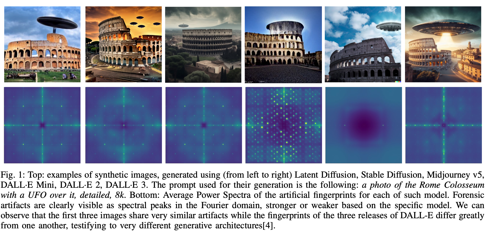
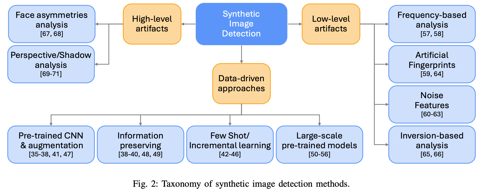
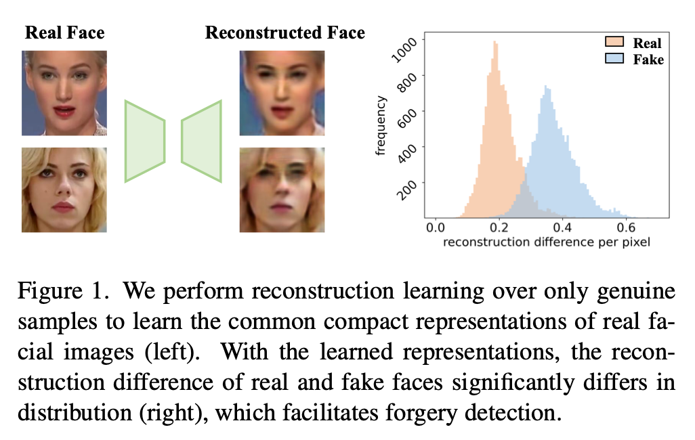
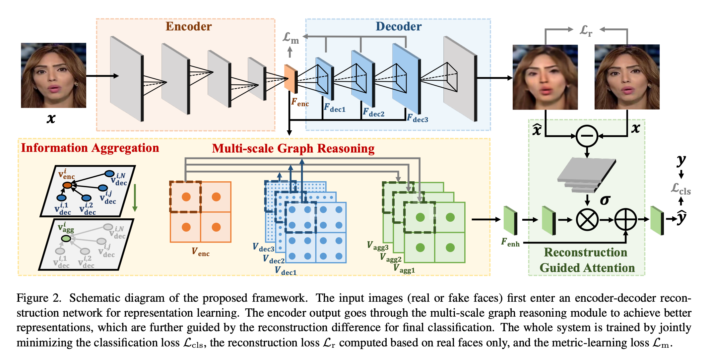
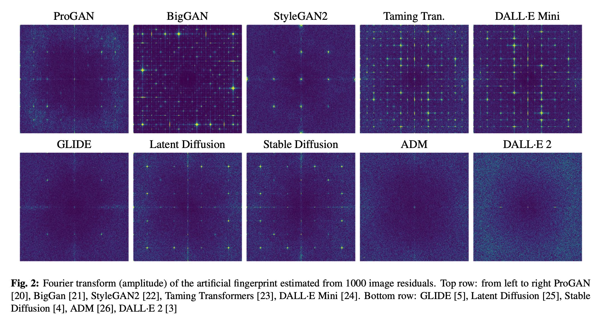
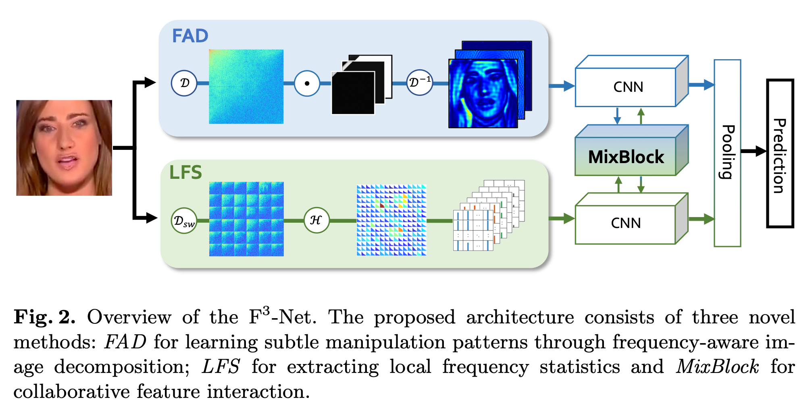
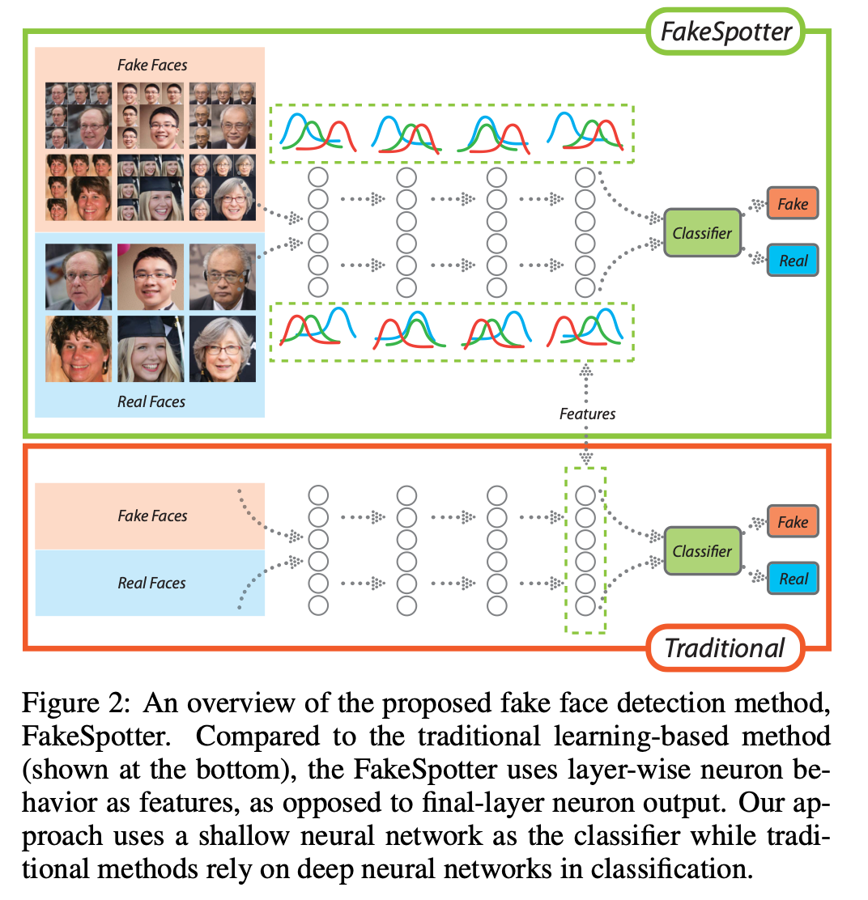
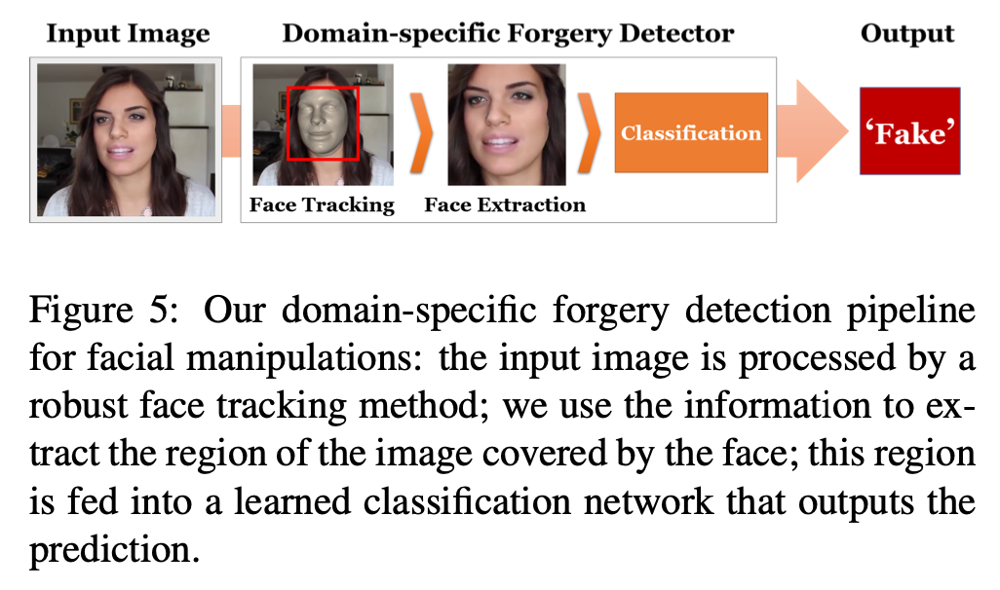
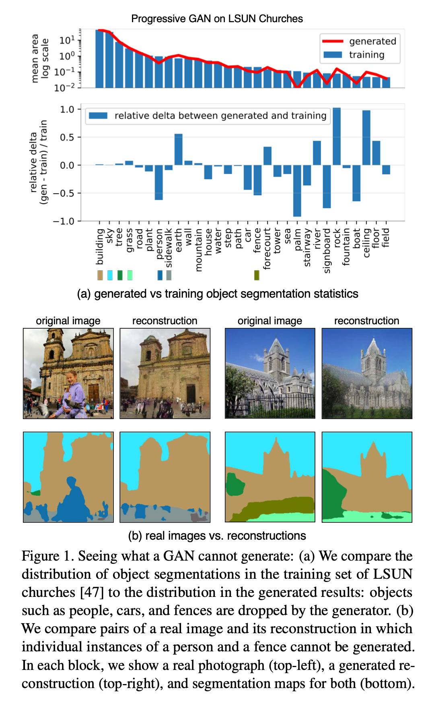

# 2025

[A Sanity Check for AI-generated Image Detection](https://arxiv.org/abs/2406.19435)
- `In this paper, we conduct a sanity check on whether the task of AI-generated image detection has been solved. To start with, we present Chameleon dataset, consisting of AI-generated images that are genuinely challenging for human perception.`
- They also propose a pretty complex model for fake detection

# 2024

[Rich and Poor Texture Contrast: A Simple yet Effective Approach for AI-generated Image Detection](https://arxiv.org/abs/2311.12397v2)
- `We conduct a comprehensive AI-generated image detection benchmark, including 16 kinds of prevalent generative models and commercial APIs like Midjourney. Multiple cutting-edge detectors are presented in the benchmark. We visualize the results with a radar chart. The concentric circles denote the detection accuracy. Our approach outperforms the state-of-the-art detector about 5% over average detection accuracy.`

[Synthetic Image Verification in the Era of Generative AI: What Works and What Isn't There Yet](https://arxiv.org/abs/2405.00196)

[FIRE: Robust Detection of Diffusion-Generated Images via Frequency-Guided Reconstruction Error](https://arxiv.org/abs/2412.07140)

# 2023

[Diffusion Noise Feature: Accurate and Fast Generated Image Detection](https://arxiv.org/abs/2312.02625) 
- `Our approach leverages the inter-pixel correlation contrast between rich and poor texture regions within an image. Pixels in rich texture regions exhibit more significant fluctuations than those in poor texture regions. This discrepancy reflects that the entropy of rich texture regions is larger than that of poor ones. Consequently, synthesizing realistic rich texture regions proves to be more challenging for existing generative models. Based on this principle, we divide an image into multiple patches and reconstruct them into two images, comprising rich-texture and poor-texture patches respectively.`

[Learning on Gradients: Generalized Artifacts Representation for GAN-Generated Images Detection](https://openaccess.thecvf.com/content/CVPR2023/papers/Tan_Learning_on_Gradients_Generalized_Artifacts_Representation_for_GAN-Generated_Images_Detection_CVPR_2023_paper.pdf) 
- `Specifically, a pretrained CNN model is employed as a transformation model to convert images into gradients. Subsequently, we leverage these gradients to present the generalized artifacts, which are fed into the classifier to ascertain the authenticity of the images. In our framework, we turn the data-dependent problem into a transformation-model-dependent problem. To the best of our knowledge, this is the first study to utilize gradients as the representation of artifacts in GAN-generated images`
- `In our experiments, we adopt various popular CNN models to implement the transformation model, including the classification model, segmentation model, discriminator of GAN, contrastive learning model, and GAN Inversion.`

[Discrepancy-Guided Reconstruction Learning for Image Forgery Detection](https://arxiv.org/abs/2304.13349)
- `In this work, we proposed a novel image forgery detection paradigm, termed DisGRL, to improve the model learning capacity on forgery-sensitive and genuine compact visual patterns. DisGRL mainly consisted of a discrepancy-guided encoder, a decoder, a double-head reconstruction module, and a discrepancy-aggregation detector head network for image forgery classification. The advantage of DisGRL was that it can not only encode general semantic features but also enhance the forgery cues of the given image. Experimental results on four widely used face forgery datasets validated the effectiveness of our proposed method against state-of-the-art competitors on both seen and unseen forgeries. DisGRL is a general paradigm, which can be used in general image forgery detection tasks.`

[Deep Image Fingerprint: Towards Low Budget Synthetic Image Detection and Model Lineage Analysis](https://arxiv.org/abs/2303.10762)
- `Our method extracts a CNN fingerprint of an image generator using a small number of generated images and applies it for the detection of other images produced by the same image generator. The method relies on the properties of CNNs, as explained below with a simple experiment`
- `extracts fingerprints from generated images, allowing us to detect images that come from the same model or its fine-tuned versions. Our method achieves high detection accuracy, surpassing methods trained under the same conditions and performing similarly to pre-trained state-of-the-art detectors for generated images from popular models.`

[DIRE for Diffusion-Generated Image Detection](https://openaccess.thecvf.com/content/ICCV2023/papers/Wang_DIRE_for_Diffusion-Generated_Image_Detection_ICCV_2023_paper.pdf)
- `we propose a novel image representation called DIffusion Reconstruction Error (DIRE), which measures the error between an input image and its reconstruction counterpart by a pre-trained diffusion model. We observe that diffusion-generated images can be approximately reconstructed by a diffusion model while real images cannot. It provides a hint that DIRE can serve as a bridge to distinguish generated and real images. DIRE provides an effective way to detect images generated by most diffusion models, and it is general for detecting generated images from unseen diffusion models and robust to various perturbations.`

# 2022

[Detecting Deepfakes with Self-Blended Images](https://arxiv.org/abs/2204.08376)
- `In this paper, we present novel synthetic training data called self-blended images (SBIs) to detect deepfakes. SBIs are generated by blending pseudo source and target images from single pristine images, reproducing common forgery artifacts (e.g., blending boundaries and statistical inconsistencies between source and target images). The key idea behind SBIs is that more general and hardly recognizable fake samples encourage classifiers to learn generic and robust representations without overfitting to manipulation-specific artifacts.`
- `Previous methods blend two distinct faces and generate artifacts based on a gap between selected source and target images. By contrast, our method blends slightly changed faces from a single image and generate artifacts actively by transformations.`

[End-to-End Reconstruction-Classification Learning for Face Forgery Detection](https://www.google.com/url?sa=t&source=web&rct=j&opi=89978449&url=https://openaccess.thecvf.com/content/CVPR2022/papers/Cao_End-to-End_Reconstruction-Classification_Learning_for_Face_Forgery_Detection_CVPR_2022_paper.pdf&ved=2ahUKEwiA_9u52-GLAxX5IBAIHVpvB64QFnoECAgQAQ&usg=AOvVaw2vQCbpCrxvX3M0u5zTfrdT)

[On the detection of synthetic images generated by diffusion models](https://arxiv.org/abs/2211.00680)
- ` To this end, first we expose the forensics traces left by diffusion models, then study how current detectors, developed for GAN-generated images, perform on these new synthetic images, especially in challenging social-networks scenarios involving image compression and resizing.`

# 2020

[What makes fake images detectable? Understanding properties that generalize](https://arxiv.org/abs/2008.10588)
- `We seek to understand what properties of fake images make them detectable and identify what generalizes across different model architectures, datasets, and variations in training. We use a patch-based classifier with limited receptive fields to visualize which regions of fake images are more easily detectable. We further show a technique to exaggerate these detectable properties and demonstrate that, even when the image generator is ad- versarially finetuned against a fake image classifier, it is still imperfect and leaves detectable artifacts in certain image patches`
- `What artifacts do classifiers learn that allow them to detect fake images generated from different models?`

[Leveraging Frequency Analysis for Deep Fake Image Recognition](https://arxiv.org/abs/2003.08685)
- `While deep fake images have been thoroughly investigated in the image domain—a classical approach from the area of image forensics—an analysis in the frequency domain has been missing so far. In this paper, we address this shortcoming and our results reveal that in frequency space, GAN-generated images exhibit severe artifacts that can be easily identified.`
- `We perform a comprehensive frequency-domain analysis of images generated by various popular GANs, revealing severe artifacts common across different neural network architectures, data sets, and resolutions.`
- `we show that frequency-representation-based classifiers yield higher accuracy, while simultaneously needing significantly fewer parameters. Additionally, these classifiers are more robust to common image perturbations.`

[Thinking in Frequency: Face Forgery Detection by Mining Frequency-aware Clues](https://arxiv.org/abs/2007.09355)
- `To introduce frequency into the face forgery detection, we propose a novel Frequency in Face Forgery Network (F3-Net), taking advantages of two different but complementary frequency-aware clues, 1) frequency-aware decomposed image components, and 2) local frequency statistics, to deeply mine the forgery patterns via our two-stream collaborative learning framework. We apply DCT as the applied frequency-domain transformation.`

[FakeSpotter: A Simple yet Robust Baseline for Spotting AI-Synthesized Fake Faces](https://arxiv.org/abs/1909.06122)
- `In this work, we propose a novel approach, named FakeSpotter, based on monitoring neuron behaviors to spot AI- synthesized fake faces. The studies on neuron coverage and interactions have successfully shown that they can be served as testing criteria for deep learning systems, especially under the settings of being exposed to adversarial attacks. Here, we conjecture that monitoring neuron behavior can also serve as an asset in detecting fake faces since layer-by-layer neuron activation patterns may capture more subtle features that are important for the fake detector.`

# 2019

[CNN-generated images are surprisingly easy to spot... for now](https://arxiv.org/abs/1912.11035) 
- `Are CNN-generated images hard to distinguish from real images? We show that a classifier trained to detect images generated by only one CNN (ProGAN) can detect those generated by many other models.`
- `Detecting whether an image was generated by a specific synthesis technique is relatively straightforward — just train a classifier on a dataset consisting of real images and images synthesized by the technique in question`

[Detecting GAN generated Fake Images using Co-occurrence Matrices](https://arxiv.org/abs/1903.06836)
- `in this paper, we compute co-occurrence matrices directly on the image pixels on each of the red, green and blue channels and pass them through a convolutional neural network, thereby allowing the network to learn important features from the co-occurrence matrices.`
- `Rather than training a network to predict a global “real” or “fake” decisions for an image, we use shallow networks with limited receptive fields that focus on small patches of the image. This approach allows us to localize regions of the image that are detected to be manipulated and ensemble the patch-wise decisions to obtain the overall prediction.`

[Detecting and Simulating Artifacts in GAN Fake Images](https://arxiv.org/abs/1907.06515)
- `To detect GAN generated images, conventional supervised machine learning algorithms require collection of a number of real and fake images from the targeted GAN model. However, the specific model used by the attacker is often unavailable. To address this, we propose a GAN simulator, AutoGAN, which can simulate the artifacts produced by the common pipeline shared by several popular GAN models. Additionally, we identify a unique artifact caused by the up-sampling component included in the common GAN pipeline. We show theoretically such artifacts are manifested as replications of spectra in the frequency domain and thus propose a classifier model based on the spectrum input, rather than the pixel input. By using the simulated images to train a spectrum based classifier, even without seeing the fake images produced by the targeted GAN model during training, our approach achieves state-of-the-art performances on detecting fake images generated by popular GAN models such as CycleGAN.`
- `It does not require any fake image in training. It only emulates and incorporates the artifacts induced by GAN pipeline into a real image.`

[FaceForensics++: Learning to Detect Manipulated Facial Images](https://arxiv.org/abs/1901.08971)
- `This paper examines the realism of state-of-the-art image manipulations, and how difficult it is to detect them, either automatically or by humans. To standardize the evaluation of detection methods, we propose an automated benchmark for facial manipulation detection. In particular, the benchmark is based on DeepFakes, Face2Face, FaceSwap and NeuralTextures as prominent representatives for facial manipulations at random compression level and size.`
- `We show that the use of additional domain specific knowledge improves forgery detection to unprecedented accuracy, even in the presence of strong compression, and clearly outperforms human observers.`

[Seeing What a GAN Cannot Generate](https://arxiv.org/abs/1910.11626)
- `Despite the success of Generative Adversarial Networks (GANs), mode collapse remains a serious issue during GAN training. To date, little work has focused on understanding and quantifying which modes have been dropped by a model. In this work, we visualize mode collapse at both the distribution level and the instance level. First, we deploy a semantic segmentation network to compare the distribution of segmented objects in the generated images with the target distribution in the training set. Differences in statistics reveal object classes that are omitted by a GAN. Second, given the identified omitted object classes, we visualize the GAN's omissions directly. In particular, we compare specific differences between individual photos and their approximate inversions by a GAN. To this end, we relax the problem of inversion and solve the tractable problem of inverting a GAN layer instead of the entire generator. Finally, we use this framework to analyze several recent GANs trained on multiple datasets and identify their typical failure cases.`

- `First, we characterize omissions in the distribution as a whole, using Generated Image Segmentation Statistics: we segment both generated and ground truth images and compare the distributions of segmented object classes. For example, Figure 1a shows that in a church GAN model, object classes such as people, cars, and fences appear on fewer pixels of the generated distribution as compared to the training distribution. Second, once omitted object classes are identified, we want to visualize specific examples of failure cases. To do so, we must find image instances where the GAN should generate an object class but does not. We find such cases using a new reconstruction method called Layer Inversion which relaxes reconstruction to a tractable problem. Instead of inverting the entire GAN, our method inverts a layer of the generator. Unlike existing methods to invert a small gen- erator [51, 8], our method allows us to create reconstructions for complex, state-of-the-art GANs. Deviations between the original image and its reconstruction reveal image features and objects that the generator cannot draw faithfully. We apply our framework to analyze several recent GANs trained on different scene datasets. Surprisingly, we find that dropped object classes are not distorted or rendered in a low quality or as noise. Instead, they are simply not rendered at all, as if the object was not part of the scene. For example, in Figure 1b, we observe that large human figures are skipped entirely, and the parallel lines in a fence are also omitted. Thus a GAN can ignore classes that are too hard, while at the same time producing outputs of high average visual quality.`