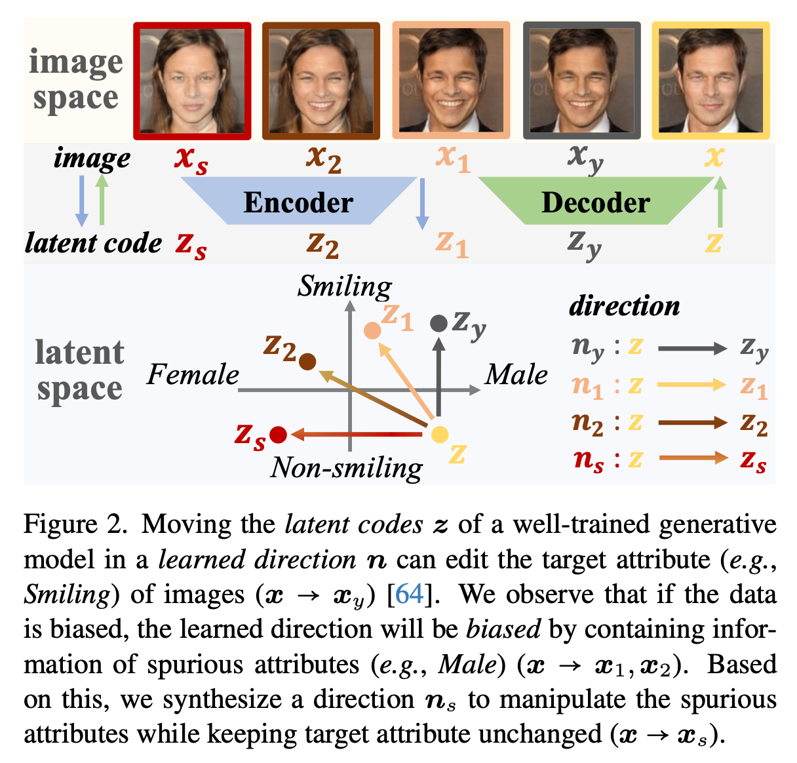
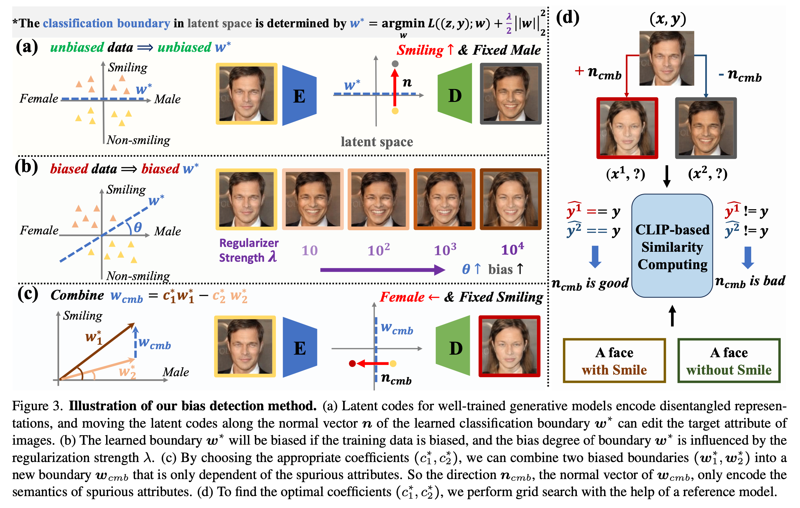
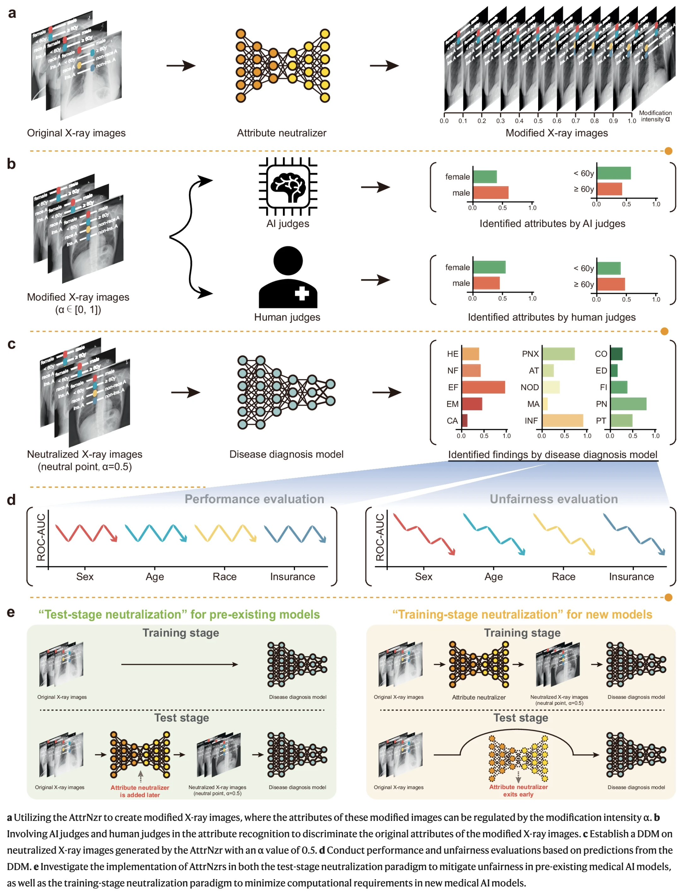
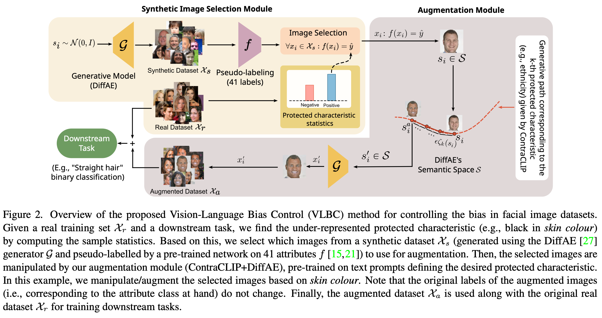
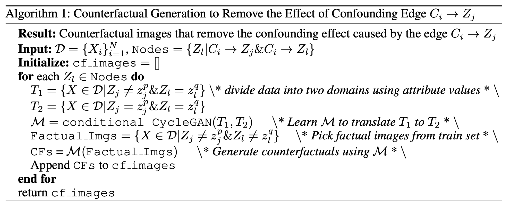
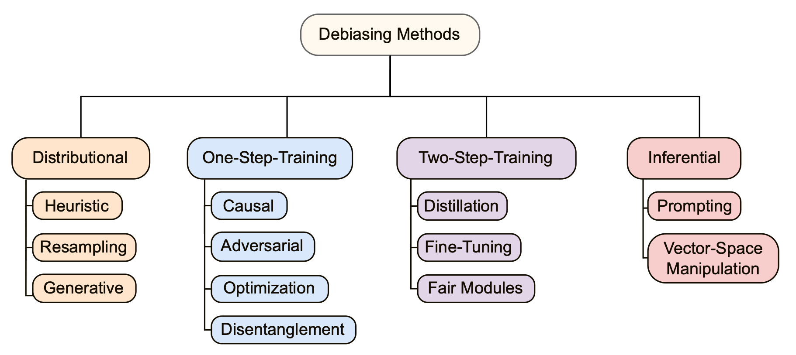
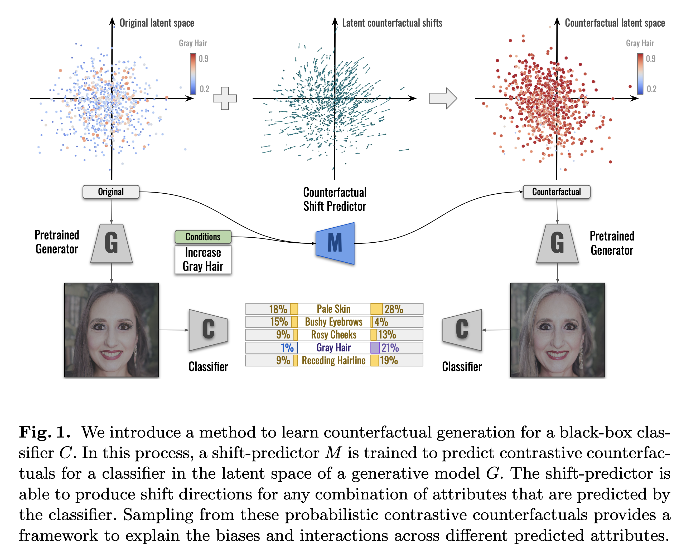

# 2025

[Constructing Fair Latent Space for Intersection of Fairness and Explainability](https://arxiv.org/abs/2412.17523)
- `we propose a novel module that constructs a fair latent space, enabling faithful explanation while ensuring fairness. The fair latent space is constructed by disentangling and redistributing labels and sensitive attributes, allowing the generation of counterfactual explanations for each type of information. Our module is attached to a pretrained generative model, transforming its biased latent space into a fair latent space. Additionally, since only the module needs to be trained, there are advantages in terms of time and cost savings, without the need to train the entire generative model.`
- For experiments, the generative model is DiffAE and Glow is chosen as the invertible neural network. 

# 2024

[Do Counterfactually Fair Image Classifiers Satisfy Group Fairness? -- A Theoretical and Empirical Study](https://openreview.net/forum?id=hFDdSd6hSM#discussion)
- `The notion of algorithmic fairness has been actively explored from various aspects of fairness, such as counterfactual fairness (CF) and group fairness (GF). However, the exact relationship between CF and GF remains to be unclear, especially in image classification tasks; the reason is because we often cannot collect counterfactual samples regarding a sensitive attribute, essential for evaluating CF, from the existing images (e.g., a photo of the same person but with different secondary sex characteristics).`
- `we construct new image datasets for evaluating CF by using a high-quality image editing method and carefully labeling with human annotators. Our datasets, CelebA-CF and LFW-CF, build upon the popular image GF benchmarks; hence, we can evaluate CF and GF simultaneously. We empirically observe that CF does not imply GF in image classification, whereas previous studies on tabular datasets observed the opposite. We theoretically show that it could be due to the existence of a latent attribute  that is correlated with, but not caused by, the sensitive attribute (e.g., secondary sex characteristics are highly correlated with hair length). From this observation, we propose a simple baseline, Counterfactual Knowledge Distillation (CKD), to mitigate such correlation with the sensitive attributes. Extensive experimental results on CelebA-CF and LFW-CF demonstrate that CF-achieving models satisfy GF if we successfully reduce the reliance on  (e.g., using CKD).`

[Navigating Neural Space: Revisiting Concept Activation Vectors to Overcome Directional Divergence](https://arxiv.org/abs/2202.03482)  
Introduces pattern-CAVs.

[Explaining in Diffusion: Explaining a Classifier Through Hierarchical Semantics with Text-to-Image Diffusion Models](https://arxiv.org/abs/2412.18604)  
Combines text-to-image diffusion models with vision-language models to edit images based on a hierarchical semantic structure of the data.

[Rethinking Fair Representation Learning for Performance-Sensitive Tasks](https://arxiv.org/abs/2410.04120)  
Presents a very elegant formalization of bias learning and the limitations of prior work.

[Fast Diffusion-Based Counterfactuals for Shortcut Removal and Generation](https://arxiv.org/abs/2312.14223)  
Propose FastDiME, an improvement over standard DiME, as a method for counterfactual explanation generation, which aims at producing examples independently from the model of interest that are later used to evaluate its reliance on shortcut features. My understanding is that they require a separate model to manipulate the images.

[Mitigating Shortcut Learning with Diffusion Counterfactuals and Diverse Ensembles](https://arxiv.org/abs/2311.16176)  
Utilize diffusion models to generate synthetic data on which a *diverse* ensemble of models is obtained.

[Reactive Model Correction: Mitigating Harm to Task-Relevant Features via Conditional Bias Suppression](https://arxiv.org/abs/2404.09601)  
P-ClArC and R-ClArC.

[Mask of truth: model sensitivity to unexpected regions of medical images](https://arxiv.org/abs/2412.04030)  
Analysis showing that models with better-than-random performance can be obtained even on the data where the class-indicative features are masked.

[Debiased Learning via Composed Conceptual Sensitivity Regularization](https://ieeexplore.ieee.org/abstract/document/10713328)  
Extends to using per-sample CAVs (Gradient CAV) 

[Mitigating attribute amplification in counterfactual image generation](https://arxiv.org/abs/2403.09422)  
Attempts to decrease the disentanglement present in generating counterfactual examples with generative causal models through soft-label fine-tuning.

[Counterfactual Explanations via Riemannian Latent Space Traversal](https://arxiv.org/abs/2411.02259)  
Uses Riemannian geometry to ensure that the generated counterfactual explanations stay on the data manifold.

[DiffInject: Revisiting Debias via Synthetic Data Generation using Diffusion-based Style Injection](https://arxiv.org/abs/2406.06134)  
Manipulates images using the h-space of a pretrained diffusion model. The nomenclature is a bit confusing, making it hard to actually state whether their approach is always unsupervised or only in the showcased scenarios.

[Enhancing Counterfactual Explanation Search with Diffusion Distance and Directional Coherence](https://arxiv.org/abs/2404.12810)  
Diffusion distance-based method for counterfactual explanation optimization.

[Leveraging Diffusion Perturbations for Measuring Fairness in Computer Vision](https://arxiv.org/abs/2311.15108)
- `In this work, we demonstrate that diffusion models can be leveraged to create such a dataset. We first use a diffusion model to generate a large set of images depicting various occupations. Subsequently, each image is edited using inpainting to generate multiple variants, where each variant refers to a different perceived race. Using this dataset, we benchmark several vision-language models on a multi-class occupation classification task.`

[Distributionally Generative Augmentation for Fair Facial Attribute Classification](https://arxiv.org/abs/2403.06606)
- `This work proposes a novel, generation-based two-stage framework to train a fair FAC model on biased data without additional annotation. Initially, we identify the potential spurious attributes based on generative models. Notably, it enhances interpretability by explicitly showing the spurious attributes in image space. Following this, for each image, we first edit the spurious attributes with a random degree sampled from a uniform distribution, while keeping target attribute unchanged. Then we train a fair FAC model by fostering model invariance to these augmentation.`

[GAMMA-FACE: GAussian Mixture Models Amend Diffusion Models for Bias Mitigation in Face Images](https://eccv.ecva.net/virtual/2024/poster/2152)
- `In this paper, we introduce a novel approach to address this issue by debiasing the attributes in generated images. Our approach involves disentangling facial attributes by localizing the means within the latent space of the diffusion model using Gaussian mixture models (GMM). This method, leveraging the adaptable latent structure of diffusion models, allows us to localize the subspace responsible for generating specific attributes on-the-fly without the need for retraining. We demonstrate the effectiveness of our technique across various face datasets, resulting in fairer data generation while preserving sample quality. Furthermore, we empirically illustrate its effectiveness in reducing bias in downstream classification tasks without compromising performance by augmenting the original dataset with fairly generated data.`
- `Our approach, GAMMA-FACE shown in Figure 1, addresses bias in downstream classification tasks related to sensitive attributes such as gender, race, and age. We utilize GMM in the noisy latent space of diffusion models to segregate features in a high-dimensional space and generate images by sampling uniformly from each component. These images are assigned pseudo-labels for attributes by pre-trained classifiers. Additionally, for downstream tasks like smile, glasses, or hair color classification, we augment original training data with generated data and their pseudo-labels.`
- Fits a GMM to the latent space of a diffusion model. Would be interesting to see if this allows for finding subgroups of specific attribute.

[Enhancing fairness in AI-enabled medical systems with the attribute neutral framework](https://www.nature.com/articles/s41467-024-52930-1)

[Utilizing Adversarial Examples for Bias Mitigation and Accuracy Enhancement](https://arxiv.org/abs/2404.11819)
-`we propose using adversarial images, that is images that deceive a deep neural network but not humans, as counterfactuals for fair model training. Our approach leverages a curriculum learning framework combined with a fine-grained adversarial loss to fine-tune the model using adversarial examples. By incorporating adversarial images into the training data, we aim to prevent biases from propagating through the pipeline.`

# 2023

[On Counterfactual Data Augmentation Under Confounding](https://arxiv.org/abs/2305.18183)

[Partial Counterfactual Identification of Continuous Outcomes with a Curvature Sensitivity Model](https://proceedings.neurips.cc/paper_files/paper/2023/hash/65cbe3e21ac62553111d9ecf7d60c18e-Abstract-Conference.html)

[Improving Fairness using Vision-Language Driven Image Augmentation](https://arxiv.org/abs/2311.01573)
- Very similiar to our approach with DiffAE. Makes additional use of CLIP to and pseudo-labeling, after which semantic paths are found and used to edit the images.
- It considers training from scratch and not necessarily unlearning.

[No Fair Lunch: A Causal Perspective on Dataset Bias in Machine Learning for Medical Imaging](https://arxiv.org/abs/2307.16526)  
Seems like a preliminary work to [Rethinking Fair Representation Learning for Performance-Sensitive Tasks](https://arxiv.org/abs/2410.04120).

[Fast Model DeBias with Machine Unlearning](https://proceedings.neurips.cc/paper_files/paper/2023/hash/2ecc80084c96cc25b11b0ab995c25f47-Abstract-Conference.html)
- Propose to measure counterfactual fairness through a low-cost influence function and unlearn the bias by making it insensitive to the undesired attribute (this is done via search over images which differ in this attribute only)

# 2022

[Robustness and Adaptation to Hidden Factors of Variation](https://arxiv.org/abs/2203.01864)
- `we employ a two step strategy that a) does unsupervised discovery, via generative models, of sensitive factors that cause models to under-perform, and b) intervenes models to make their performance invariant to these sensitive factors' influence. We consider 3 separate interventions for robustness, including: data augmentation, semantic consistency, and adversarial alignment`

[Counterfactual Generation Under Confounding](https://arxiv.org/abs/2210.12368)

[Debiasing Methods for Fairer Neural Models in Vision and Language Research: A Survey](https://arxiv.org/abs/2211.05617)

[Evaluating and Mitigating Bias in Image Classifiers: A Causal Perspective Using Counterfactuals](https://arxiv.org/abs/2009.08270)  
Generates counterfactuals with the use of assumed *causal graph* and does different things with it, e.g., bias mitigation.

[Probing Classifiers are Unreliable for Concept Removal and Detection](https://proceedings.neurips.cc/paper_files/paper/2022/hash/725f5e8036cc08adeba4a7c3bcbc6f2c-Abstract-Conference.html)
- describes the theoretical limitations of probing classifiers in full removal of an undesired concept (in both post-hoc and joint training methods)
- provides empirical results supporting these claims

[Explaining Image Classifiers Using Contrastive Counterfactuals in Generative Latent Spaces](https://arxiv.org/abs/2206.05257)

# 2021

[UDIS: Unsupervised Discovery of Bias in Deep Visual Recognition Models](https://www.bmvc2021-virtualconference.com/assets/papers/0362.pdf)
- `we propose UDIS, an unsupervised algorithm for surfacing and analyzing such failure modes. UDIS identifies subpopulations via hierarchical clustering of dataset embeddings and surfaces systematic failure modes by visualizing low performing clusters along with their gradient-weighted class-activation maps. We show the effectiveness of UDIS in identifying failure modes in models trained for image classification on the CelebA and MSCOCO datasets.`

# 2019

[Finding and Removing Clever Hans: Using Explanation Methods to Debug and Improve Deep Models](https://arxiv.org/abs/1912.11425)  
Spectral Relevance Analysis, P-ClArC, A-ClArC.

[Invariant Risk Minimization](https://arxiv.org/abs/1907.02893)
- `We introduce Invariant Risk Minimization (IRM), a learning paradigm to estimate invariant correlations across multiple training distributions. To achieve this goal, IRM learns a data representation such that the optimal classifier, on top of that data representation, matches for all training distributions. Through theory and experiments, we show how the invariances learned by IRM relate to the causal structures governing the data and enable out-of-distribution generalization.`